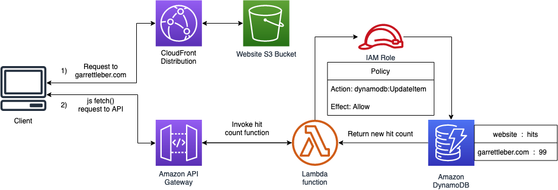

# garrettleber.com - Backend

## DEPRECATED

**See new repo using Pulumi for live backend**
https://github.com/lebergarrett/lebergarrett.com-backend-aws

### Original Description

This repo holds the backend code for my personal website, created as part of the cloud resume challenge located at <https://cloudresumechallenge.dev>

`main.tf` creates the S3 bucket the website is hosted in, maintains the route53 zone, and the SSL certificate (managed by ACM). The certificate and domain are attached to the S3 bucket through a CloudFront distribution.

`code_pipeline.tf` contains the code to create the Continuous Delivery pipeline for frontend resources (html, css, js, etc) that updates the site anytime `master` receives a commit on the `garrettleber-frontend` repo. I could have set up Github Actions on that repo (much like this one) to do the same thing, but chose to experiment with AWS's solution.

`visitors_app.tf` uses the packaged Python lambda function included in `src/`, spins it up in AWS and configures the proper role to give it the permissions it needs. It also creates the REST API that invokes the function, and spits that out as output to be used in the frontend (`counter.js`). Lastly, it creates the necessary DynamoDB table that stores the data for the visitor counter. Here's a flow diagram to illustrate

I use Github Actions to create a pipeline that runs unit tests for the lambda function, and `terraform plan` for pull requests. The output of the plan is added to the PR as a comment. When a pull request is merged to master it reruns the unit tests, packages and uploads the lambda function if the hash has changed, and runs `terraform apply`.
